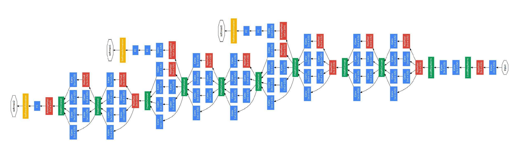
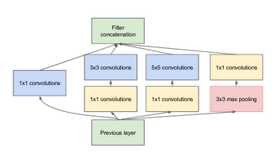
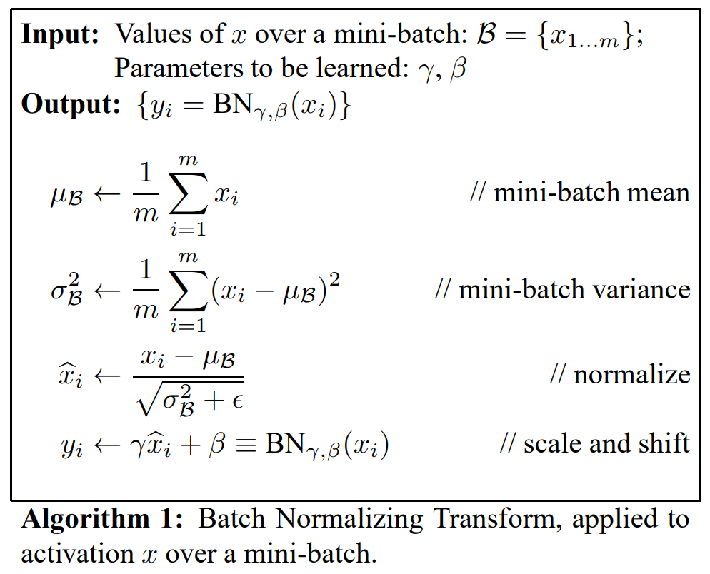
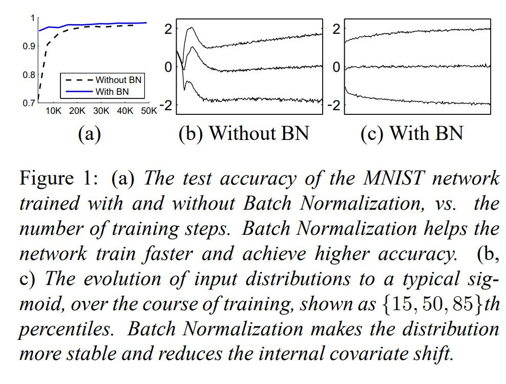
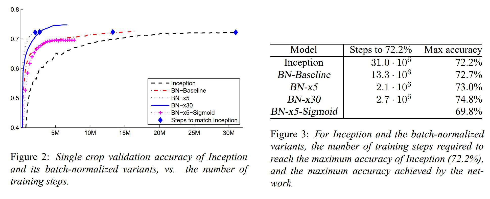
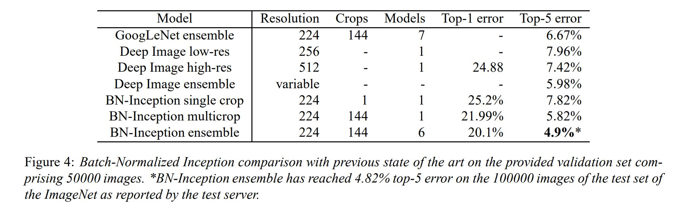

# Inception v2

## 简介

Inception v2 并没有在结构上作出太大改变，但是首次提出了使用Batch Normalization ，即将一个batch的数据变换到均值为0、方差为1的正太分布上，从而使数据分布一致，每层的梯度不会随着网络结构的加深发生太大变化，从而避免发生梯度消失。

加入了BN层，减少了Internal Covariate Shift（内部neuron的数据分布发生变化），使每一层的输出都规范化到一个N(0, 1)的高斯； 学习VGG用2个3x3的conv替代inception模块中的5x5，既降低了参数数量，也加速计算；使用3×3的已经很小了，那么更小的2×2呢？2×2虽然能使得参数进一步降低，但是不如另一种方式更加有效，那就是Asymmetric方式，即使用1×3和3×1两种来代替3×3的卷积核。这种结构在前几层效果不太好，但对特征图大小为12~20的中间层效果明显。 

 

Christian 和他的团队都是非常高产的研究人员。2015 年 2 月，Batch-normalized Inception 被引入作为 Inception V2。

Batch-normalization 在一层的输出上计算所有特征映射的均值和标准差，并且使用这些值规范化它们的响应。这相当于数据「增白（whitening）」，因此使得所有神经图（neural maps）在同样范围有响应，而且是零均值。在下一层不需要从输入数据中学习 offset 时，这有助于训练，还能重点关注如何最好的结合这些特征。

 

Inception V2学习了VGGNet，用两个3´3的卷积代替5´5的大卷积（用以降低参数量并减轻过拟合），还提出了著名的Batch Normalization（以下简称BN）方法。BN是一个非常有效的正则化方法，可以让大型卷积网络的训练速度加快很多倍，同时收敛后的分类准确率也可以得到大幅提高。BN在用于神经网络某层时，会对每一个mini-batch数据的内部进行标准化（normalization）处理，使输出规范化到N(0,1)的正态分布，减少了Internal Covariate Shift（内部神经元分布的改变）。

BN的论文指出，传统的深度神经网络在训练时，每一层的输入的分布都在变化，导致训练变得困难，我们只能使用一个很小的学习速率解决这个问题。而对每一层使用BN之后，我们就可以有效地解决这个问题，学习速率可以增大很多倍，达到之前的准确率所需要的迭代次数只有1/14，训练时间大大缩短。而达到之前的准确率后，可以继续训练，并最终取得远超于Inception V1模型的性能——top-5错误率4.8%，已经优于人眼水平。因为BN某种意义上还起到了正则化的作用，所以可以减少或者取消Dropout，简化网络结构。

当然，只是单纯地使用BN获得的增益还不明显，还需要一些相应的调整：增大学习速率并加快学习衰减速度以适用BN规范化后的数据；去除Dropout并减轻L2正则（因BN已起到正则化的作用）；去除LRN；更彻底地对训练样本进行shuffle；减少数据增强过程中对数据的光学畸变（因为BN训练更快，每个样本被训练的次数更少，因此更真实的样本对训练更有帮助）。在使用了这些措施后，Inception V2在训练达到Inception V1的准确率时快了14倍，并且模型在收敛时的准确率上限更高。

## 网络结构





Inception v2 并没有在结构上作出太大改变，但是首次提出了使用Batch Normalization ，即将一个batch的数据变换到均值为0、方差为1的正太分布上，从而使数据分布一致，每层的梯度不会随着网络结构的加深发生太大变化，从而避免发生梯度消失。

### BN



输入的是一个batch的图片（或者特征层），格式为NHWC；

计算过程：
1. 计算数据的均值u；
2. 计算数据的方差σ^2；
3. 通过公式 x’=(x-u)/√(σ^2+ε)标准化数据；
4. 通过公式 y=γx’+β 进行缩放平移；

注：
1. ε 是一个较小正数值，防止除零；
2. 其中γ和β是可训练参数；
3. 使用batch normalization时，全链接层可以不必加上bias，因为这时β就相当于加上了一个偏置值；
4. 输入测试数据时，u和σ取的是全部train_data的均值和标准差；

## 实验结果



可以看出BN的效果十分显著





最终结果 Top-5 Error 从6.67%下降到了4.9%。

## 代码实现

```python
import tensorflow as tf
slim = tf.contrib.slim
def Incvption_v1_net(inputs, scope):
  with tf.variable_scope(scope):
    with slim.arg_scope([slim.conv2d],
              activation_fn=tf.nn.relu, padding='SAME',
              weights_regularizer=slim.l2_regularizer(5e-3)):
      net = slim.max_pool2d(
        inputs, [3, 3], strides=2, padding='SAME', scope='max_pool')
      net_a = slim.conv2d(net, 64, [1, 1], scope='conv2d_a_1x1')
      net_b = slim.conv2d(net, 96, [1, 1], scope='conv2d_b_1x1')
      net_b = slim.conv2d(net_b, 128, [3, 3], scope='conv2d_b_3x3')
      net_c = slim.conv2d(net, 16, [1, 1], scope='conv2d_c_1x1')
      net_c = slim.conv2d(net_c, 32, [5, 5], scope='conv2d_c_5x5')
      net_d = slim.max_pool2d(
        net, [3, 3], strides=1, scope='pool3x3', padding='SAME')
      net_d = slim.conv2d(
        net_d, 32, [1, 1], scope='conv2d_d_1x1')
  net = tf.concat([net_a, net_b, net_c, net_d], axis=-1)
  net = tf.layers.batch_normalization(net, name='BN')
  return net
```

## 参考资料

[[1] Batch Normalization: Accelerating Deep Network Training b
y
Reducing Internal Covariate Shift](https://arxiv.org/pdf/1502.03167.pdf)

[[2] 经典网络结构GoogleNet之Inception-v1 v2 v3 v4 Resnet](https://blog.csdn.net/julialove102123/article/details/79632721)

[[3] GoogleNet系列网络原理及结构详解：从Inception-v1到v4](https://blog.csdn.net/weixin_44936889/article/details/103739153)