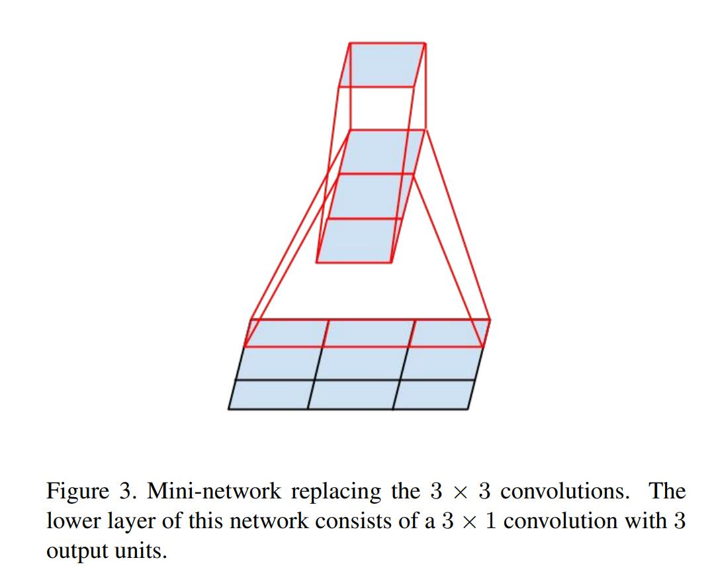
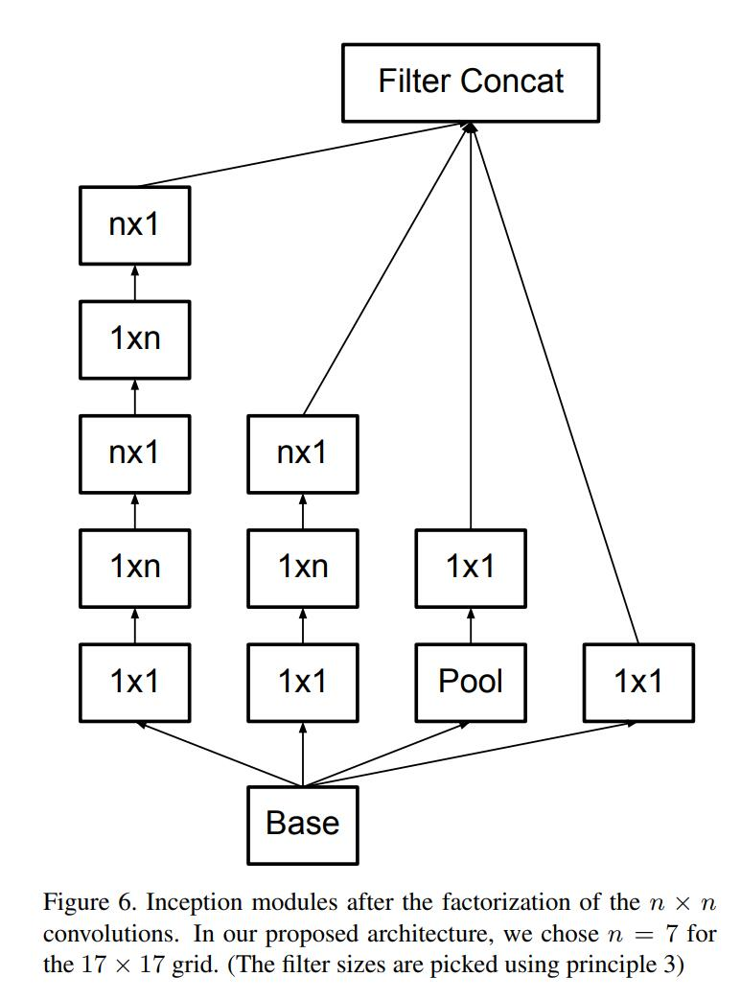
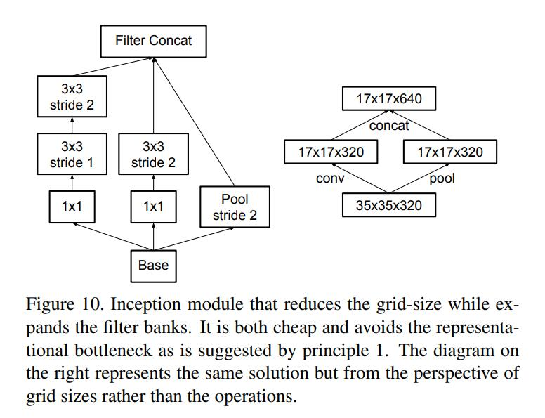
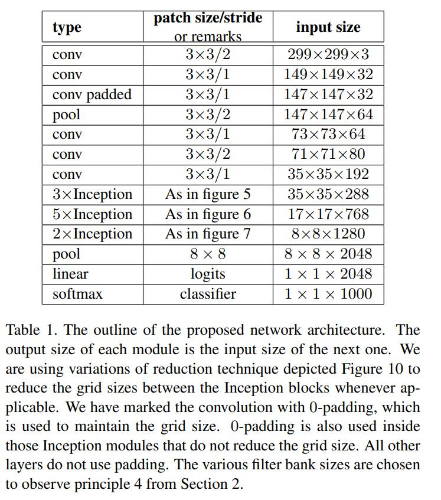
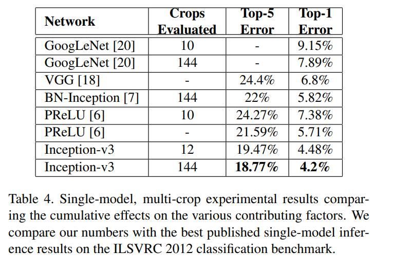
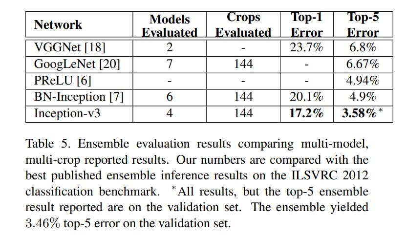

# Inception-V3

## 简介

v3一个最重要的改进是分解（Factorization），将7x7分解成两个一维的卷积（1x7,7x1），3x3也是一样（1x3,3x1），这样的好处，既可以加速计算（多余的计算能力可以用来加深网络），又可以将1个conv拆成2个conv，使得网络深度进一步增加，增加了网络的非线性，还有值得注意的地方是网络输入从224x224变为了299x299，更加精细设计了35x35/17x17/8x8的模块。

## 网络结构

通过谨慎建筑网络，平衡深度与宽度，从而最大化进入网络的信息流。在每次池化之前，增加特征映射。
当深度增加时，网络层的深度或者特征的数量也系统性的增加。
使用每一层深度增加在下一层之前增加特征的结合。
而Inception V3网络则主要有两方面的改造：

### 一

引入了Factorization into small convolutions的思想，将一个较大的二维卷积拆成两个较小的一维卷积，比如将7´7卷积拆成1´7卷积和7´1卷积，或者将3´3卷积拆成1´3卷积和3´1卷积，如图2所示。

- 一方面节约了大量参数，加速运算并减轻了过拟合（比将7´7卷积拆成1´7卷积和7´1卷积，比拆成3个3´3卷积更节约参数），
- 一方面增加了一层非线性扩展模型表达能力。论文中指出，这种非对称的卷积结构拆分，其结果比对称地拆为几个相同的小卷积核效果更明显，可以处理更多、更丰富的空间特征，增加特征多样性。



只使用 3×3 的卷积，可能的情况下给定的 5×5 和 7×7 过滤器能分成多个 3×3。

### 二

Inception V3优化了Inception Module的结构，现在Inception Module有35´35、17´17和8´8三种不同结构，如图3所示。这些Inception Module只在网络的后部出现，前部还是普通的卷积层。并且Inception V3除了在Inception Module中使用分支，还在分支中使用了分支（8´8的结构中），可以说是Network In Network In Network。



在进行 inception 计算的同时，Inception 模块也能通过提供池化降低数据的大小。这基本类似于在运行一个卷积的时候并行一个简单的池化层：



Inception 也使用一个池化层和 softmax 作为最后的分类器。




## 实验结果





## 代码实现

```python
import tensorflow as tf
slim = tf.contrib.slim
def Incvption_v1_net(inputs, scope):
  with tf.variable_scope(scope):
      with slim.arg_scope([slim.conv2d],
              activation_fn=tf.nn.relu, padding='SAME',
              weights_regularizer=slim.l2_regularizer(5e-3)):
      net = slim.max_pool2d(
        inputs, [3, 3], strides=2, padding='SAME', scope='max_pool')
      net_a = slim.conv2d(net, 64, [1, 1], scope='conv2d_a_1x1')
      net_b = slim.conv2d(net, 96, [1, 1], scope='conv2d_b_1x1')
      net_b_1 = slim.conv2d(net_b, 128, [1, 3], scope='conv2d_b_1x3')
      net_b_2 = slim.conv2d(net_b, 128, [3, 1], scope='conv2d_b_3x1')
      net_c = slim.conv2d(net, 16, [1, 1], scope='conv2d_c_1x1')
      net_c = slim.conv2d(net_c, 32, [3, 3], scope='conv2d_c_3x3')
      net_c_1 = slim.conv2d(net_c, 32, [1, 3], scope='conv2d_c_1x3')
      net_c_2 = slim.conv2d(net_c, 32, [3, 1], scope='conv2d_c_3x1')
      net_d = slim.max_pool2d(
        net, [3, 3], strides=1,  scope='pool3x3', padding='SAME')
      net_d = slim.conv2d(
        net_d, 32, [1, 1], scope='conv2d_d_1x1')
  net = tf.concat(
    [net_a, net_b_1, net_b_2, net_c_1, net_c_2, net_d], axis=-1)  
  net = tf.layers.batch_normalization(net, name='BN')
  return net
```
## 参考资料

[[1] Rethinking the Inception Architecture for Computer Vision](https://arxiv.org/pdf/1512.00567.pdf)

[[2] 经典网络结构GoogleNet之Inception-v1 v2 v3 v4 Resnet](https://blog.csdn.net/julialove102123/article/details/79632721)

[[3] GoogleNet系列网络原理及结构详解：从Inception-v1到v4](https://blog.csdn.net/weixin_44936889/article/details/103739153)